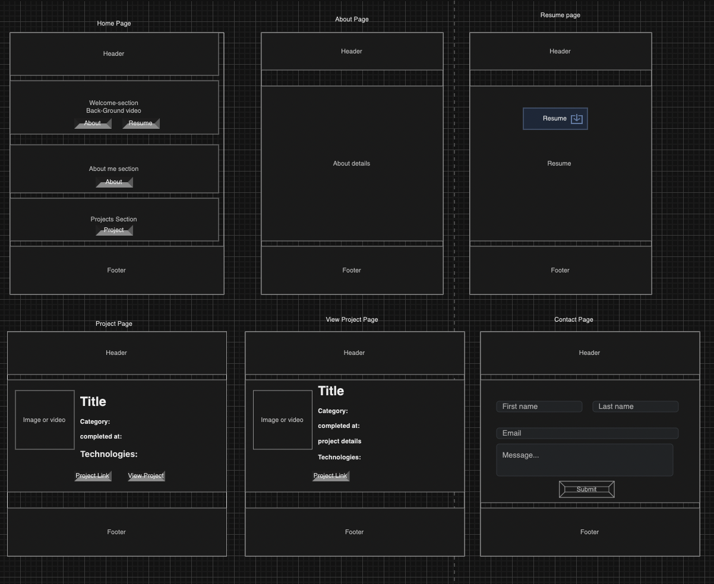

# UNIT-2-PROJECT

## Create a Personal Website

A personal website is website that represents you , your work , your career , your interests and so on. It could be highly stylish , fun, or simple, serious and so on. You choose how you represent yourself online !

### Inspirations:
- https://www.shanekinkennon.com
- https://www.joshrubietta.com
- https://www.jencarrington.com
- https://www.amywutoo.com
- https://www.ginakirlew.com

## Minumum Requirements

- Use Django.
- Use Templates & Template Inheritance.
- Organize your project in apps as needed.
- Use models to represent you data.
- Use naming conventions.
- Strive to make the user journey intuitive and complete.
- At least 4 pages.
- At least 2 models.
- Must be responsive (looks good on big & small screens). 
- You can use a CSS library to style your website (such as Bootstrap or equivalent)
- You can use a cdn or a cloud storage to host large files such as large videos (example: Goolge Firebase Cloud Storage: https://firebase.google.com/docs/storage)
- User Stories(shared as a link to document or added as a file).
- Wireframe (shared as link or uploaded as a file) - You can use Figma or similar online wireframing/design software.
- UML (shared as a link or uploaded as a file) - You can use Lucid Charts or similar online UML design tool.

## Ali ALMaghamsi 

## Features List

## Visitor Side:

# Home Page:
A welcoming introduction and a hub for all the pages

# About Page:
Details about My professional journey, education, and experiences.
Showcase My skills with visuals like charts or lists.

# Resume Page:

Include a downloadable PDF of My resume.
And My resume if a vistor wants to see it 

# Projects Page:

list view of My projects, displaying a preview (e.g., title, category, date, and thumbnail).

Clicking a project redirects to the View Project Page.

View Project Page:

Detailed information about a specific project:
Title, description, technologies, date, links, and media (video/image).

# Contact Page:

A form where visitors can send a messages.
Include fields like name, email, and message.

## Admin Dashboard:

# Manage Messages:

View messages received via the contact form.

# Manage Projects:

Add a Project: Provide fields for title, description, category, date, media (image/video), and technologies.
Update a Project: Edit project details.
Delete a Project: Remove a project from the site.

## User Stories, Wireframes & UML links
[User Stories Document](req/userStories.pdf)

# Wireframes

## Visitor Wireframe

## Dashboard Wireframe

## UML Diagrams for Models

## Resources:

### Free high quality images :
- https://www.pexels.com/
- https://unsplash.com

### Free sounds website:
- https://mixkit.co/

### Free stock videos:
- https://pixabay.com/videos/

### Free Fonts:
- https://fonts.google.com

### CSS Library:
- https://getbootstrap.com/
- https://get.foundation/index.html
- https://tailwindcss.com/

### CSS Animation libraries:
- https://animate.style
- https://www.minimamente.com/project/magic/
